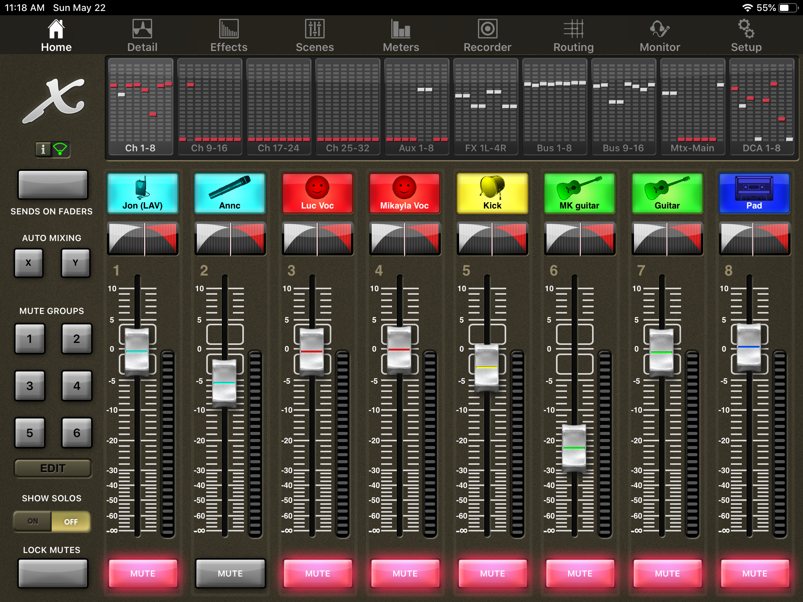
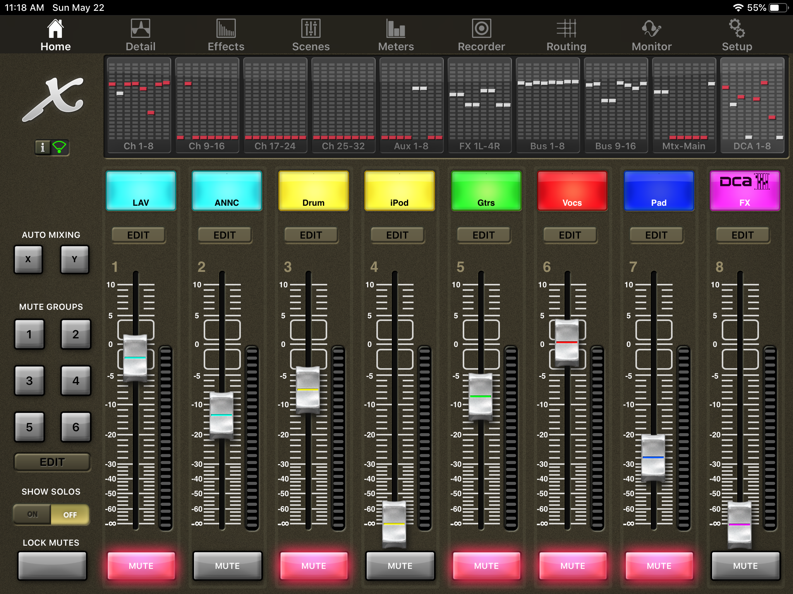
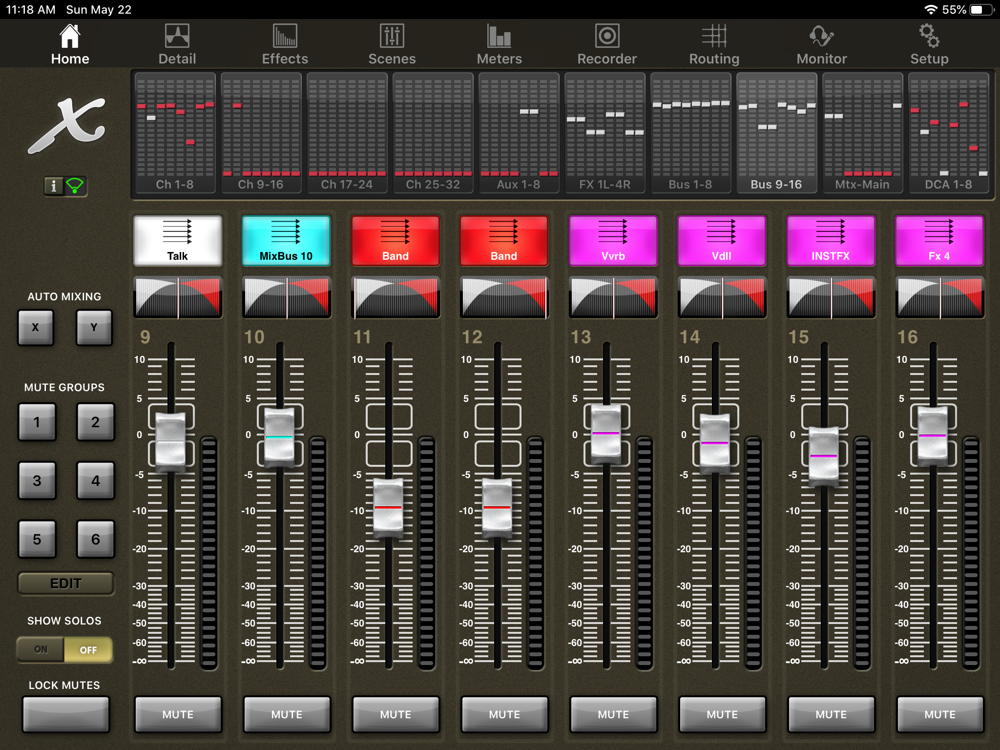
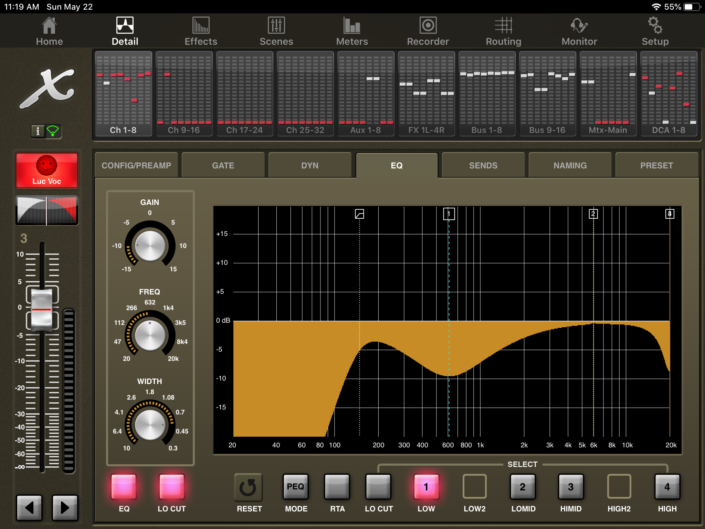
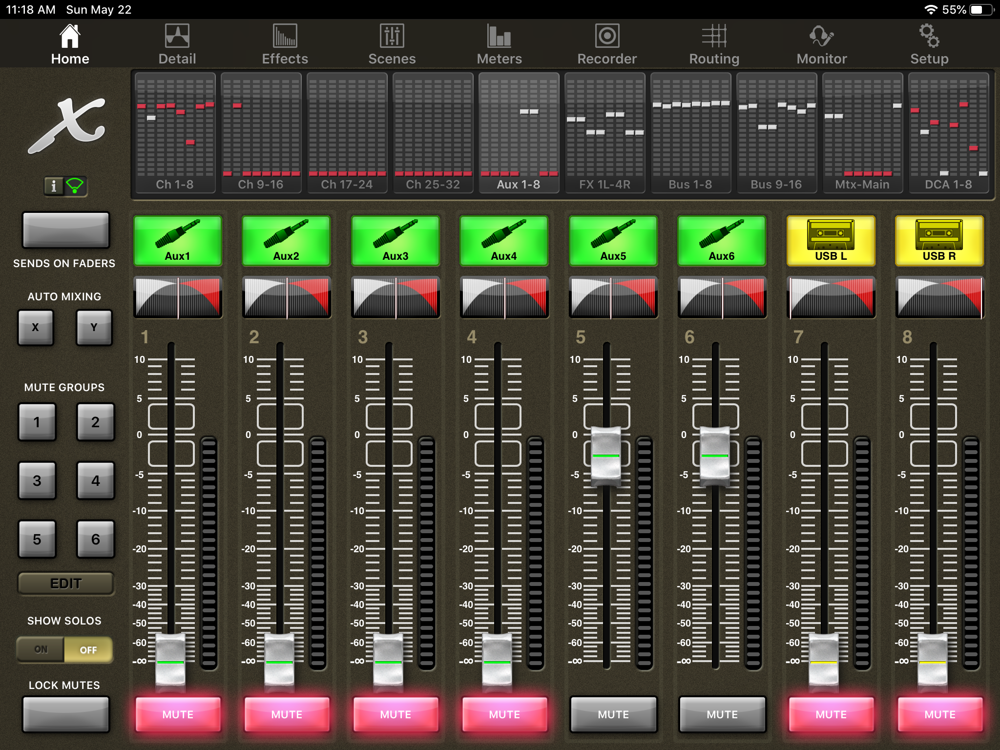
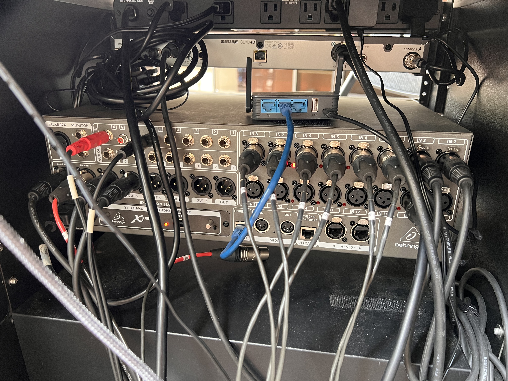
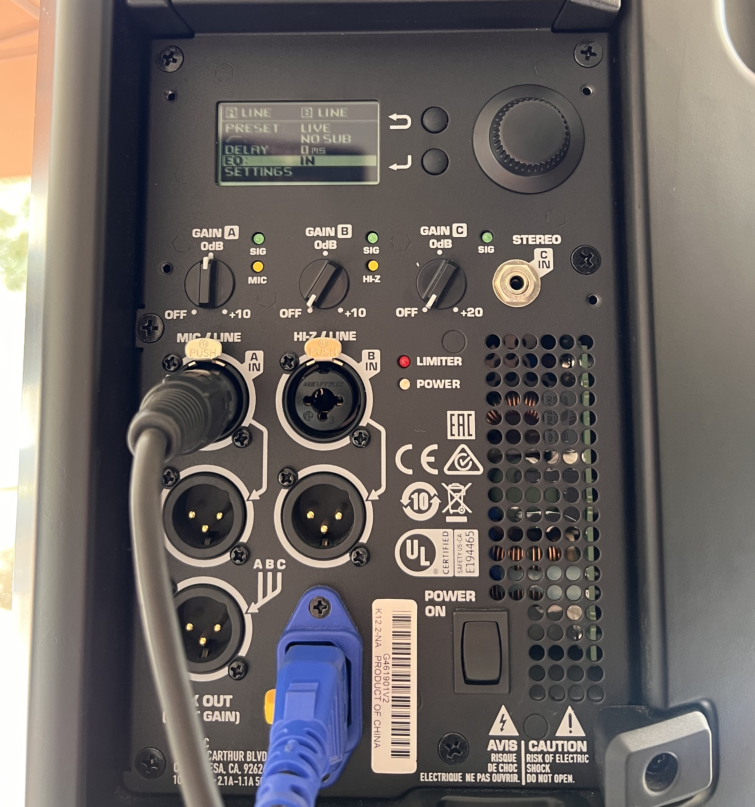
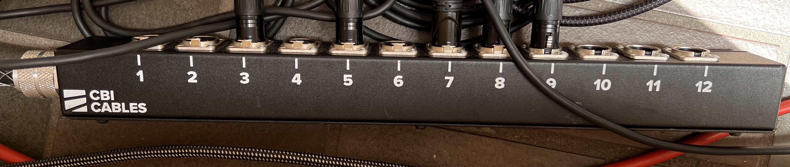

# Sound Team Documentation

## Introduction
Hello and thanks for volunteering for Southlands Santa Ana’s Sound team!

* Sound Lead: Nick Plunkett
* Team Members: David Walton

## Quick Reference: iPad Mixer Controls

By reviewing the below sections, you should have enough information to get the sound running quickly and easily on any Sunday. More in-depth info will be covered later.

###Inputs

Default screen (Home, Ch1-8). This is where your inputs are. From left to right, Input 1 to Input 8 on the back of the mixer. 

Your goal on this screen is to have the instruments registering input as expected at a reasonable dB level (not clipping or yellow/red on the bar next to the fader). You can then adjust them as a group on the Show mix controls screen (DCA 1-8) and the Stream Band/Voice controls screen (Bus 1-8).

Mutes here control both stream and show sound.

###Show mix controls (DCA 1-8)

Show mix controls (DCA 1-8). 

**This is your volume control for the speakers during the service**

This is where you control the levels of the different inputs, and this only affects the sound coming out of the speakers. Mutes here only control sound coming out of the speakers. 

If you change the inputs on the Default screen (Home, Ch1-8), push Edit and then select/deselect the corresponding inputs on this screen to match.

FX controls the amount of Reverb being applied. This is useful to have the ability to turn down the reverb when the worship leader is talking during worship rather than singing. If they start talking, turn down the FX or it will start to sound weird. When they're done talking and they start singing again, turn the FX back up to 0dB.

###Stream and FX Levels controls (Bus 9-16)

Stream and FX levels controls (Bus 9-16). This is where you can adjust the levels at a basic level for the stream outputs (XLR output 5+6, XLR output 3+4) on the back of the mixer. By default, Talk is the Lav and the Announcements mic, and Band is the instrument and vocal inputs.

### EQ Adjustment Screen

EQ Adjustment screen. The yellow part is the part that is being reduced/cut. Lows mids and highs are adjustable with 4 bars. Pinch-in to make the curve sharper. Pinch-out to make the curve less sharp. Typically if you have a singer and an instrument you want to at least do a lo cut on the singer’s input to let the instrument fill in the lows. Adjust these to your preference based on what you hear.

### Aux 1-8 Screen

Aux 1-8 screen. This is where you control the input level of your phone audio coming into the mixer. There is a 3.5mm to RCA cable plugged into the Aux 5+6 inputs on the back of the mixer.

## Quick Reference: Physical Inputs/Outputs

### Mixer Rear

On the right are the 16 inputs (32 inputs of L+R). On the left are the outputs, starting with the Main Speaker outputs (L, R), and the individual XLR outputs.

The wireless LAV microphone is always connected to input 1. The wireless announcement microphone is always connected to input two.

The Snake is (almost) always connected to inputs 3-9, and ouputs 1-4.

### Speakers

This is how the speakers should look from the backside during a service.

Next to "Preset" on the screen it should say "Live". There should always be 0ms of delay. Always connect to Input A. Do not adjust the gain on the speaker itself.

### Snake

Default Configuration:

Snake I/O # | iPad Label | Mixer I/O #
--- | --- | ---
Snake #1 (Input) | Keys | Mixer Input #9
Snake #2 (Input) | Snare | Mixer Input #10
Snake Input 3 | Vocal #1 | Mixer Input #3
Snake Input 4 | Vocal #2 | Mixer Input #4
Snake Input 5 | Kick Drum | Mixer Input #5
Snake Input 6 | Guitar #1 | Mixer Input #6
Snake Input 7 | Guitar #2 | Mixer Input #7
Snake Input 8 | Pad | Mixer Input #8

We usually do not disconnect the snake after church, so this table should be relatively static.